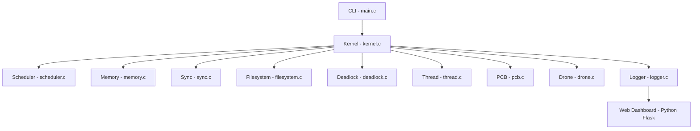

# FleetOS — Operating System Simulation Engineering Report

| Field        | Value                                           |
|--------------|-------------------------------------------------|
| Course       | Operating Systems                               |
| Language     | C (C99)                                         |
| Theme        | Drone Fleet Controller                          |
| Repository   | https://github.com/Saewt/fleetos (branch: dev)  |

---

## 1. System Overview & Theme

FleetOS is a modular operating system simulator designed around a drone fleet management environment. The system models how a centralized operating system kernel coordinates multiple autonomous drone processes competing for CPU time, memory, synchronization primitives, storage, and shared runtime resources.

Unlike purely theoretical operating system demonstrations, FleetOS integrates multiple subsystems into a unified execution pipeline where process scheduling, paging, blocking, deadlock detection, and filesystem operations interact continuously during runtime.

Four drone processes run concurrently, each with a distinct priority and mission profile:

| PID | Name         | Priority | Arrival | Commands                               |
|-----|-------------|----------|---------|---------------------------------------|
| 0   | Flight      | HIGH     | 0       | COMPUTE, PRODUCE, ACQUIRE             |
| 1   | Battery     | CRITICAL | 0       | COMPUTE, ACQUIRE, IO_WRITE            |
| 2   | Mapping     | NORMAL   | 2       | COMPUTE, CONSUME, IO_WRITE            |
| 3   | LogCollector| LOW      | 4       | CONSUME, IO_WRITE                     |

Each process spawns two threads (main + worker), scheduled independently by the kernel. The system is **tick-driven** (1 tick = one scheduling cycle). Every tick the kernel dispatches the current thread, executes its next command, processes pending I/O and page fault completions, checks for deadlocks, and emits a structured JSON event log. This log feeds a Python Flask dashboard for real-time visualization.

The system is built entirely in C with no external dependencies beyond the standard library. The codebase is approximately **2,800 lines** across 22 source files in `src/`.

---

## 2. Architecture Diagram

The architecture is described in `docs/architecture.mmd` (Mermaid diagram):



**Component map:**

```
CLI (main.c)
  |
Kernel (kernel.c)  <-- tick loop, event dispatch, snapshot
  |
  +-- Scheduler (scheduler.c)     RR + MLFQ, TCB-based queues
  +-- Memory    (memory.c)        Paging + LRU eviction
  +-- Sync      (sync.c)          Mutex + CondVar + BoundedBuffer
  +-- Filesystem (filesystem.c)   FAT table, create/read/write/delete
  +-- Deadlock  (deadlock.c)      Resource graph, DFS detection, victim
  +-- Thread    (thread.c)        TCB abstraction, per-process threads
  +-- PCB       (pcb.c)           Process control block, JSON serialization
  +-- Drone     (drone.c)         Drone type definitions, commands
  |
Logger (logger.c) --> stdout JSON
  |
Web Dashboard (Python Flask) <-- reads JSON from simulator stdout
```

The data flow is strictly pipeline: **C simulator → JSON stdout → Python server parses JSON lines → WebSocket push → HTML/JS dashboard renders**.

Sequence diagrams for key interactions are available in:
- `docs/sequence_file_io.mmd` — IO_WRITE → block → scheduler switch
- `docs/sequence_page_fault.mmd` — Page fault → block → scheduler switch
- `docs/buffer_produce_consume.mmd` — Mutex/CondVar → producer-consumer
- `docs/deadlock_detect.mmd` — Resource graph → DFS cycle → victim resolution

---

## 3. Key Design Decisions & Alternatives

For each major subsystem we document what was chosen, at least one alternative considered, why the alternative was rejected, and the accepted trade-off.


### 3.1 Scheduler: RR + MLFQ Dual Implementation

| Aspect      | Decision                                                              |
|-------------|-----------------------------------------------------------------------|
| **Chosen**  | Combined Round-Robin (RR) and Multi-Level Feedback Queue (MLFQ) selected via `--mode` flag. A `--compare` flag runs both and outputs comparison metrics (context switches, total/avg/max wait time, avg/max turnaround time, terminated count). |
| **Considered** | Priority-only scheduling (fixed priority, no preemption).          |
| **Why not** | Fixed priority causes starvation for low-priority drones (e.g., LogCollector). MLFQ naturally demotes CPU-bound threads and promotes I/O-bound threads via periodic priority boost. |
| **Trade-off** | MLFQ requires tuning (quantum sizes, boost interval, number of queues). We accept this complexity for starvation-free behaviour. RR serves as the fair baseline for quantitative comparison. |

**MLFQ queues:**
| Queue | Priority        | Quantum |
|-------|-----------------|---------|
| Q0    | CRITICAL, HIGH  | 2       |
| Q1    | NORMAL          | 4       |
| Q2    | LOW             | 8       |

- **Priority boost**: Every 30 real ticks, all threads from Q1/Q2 are boosted to Q0.
- **Demotion**: When a thread exhausts its quantum in QN, it moves to Q(N+1) (max Q2).


### 3.2 Memory Management: Paging with LRU Eviction

| Aspect      | Decision                                                              |
|-------------|-----------------------------------------------------------------------|
| **Chosen**  | Fixed-size paging (256 B pages, 16 frames). LRU eviction selects the least-recently-accessed frame when free frames are exhausted. Page faults are triggered deterministically every 8 ticks on the currently running thread (duration = 3 ticks). In deadlock mode, page faults are disabled to prevent timing interference. |
| **Considered** | Segmentation (variable-size segments).                             |
| **Why not** | Segmentation leads to external fragmentation and complicates simulation. Paging is simpler and cleanly demonstrates address translation and demand-paging fault handling. |
| **Trade-off** | Fixed 4 KB address space per process (16 pages × 256 B). A process cannot grow beyond this. For small drone workloads this is sufficient. |

**Configuration:**
| Parameter           | Value   |
|---------------------|---------|
| PAGE_SIZE           | 256 B   |
| FRAME_COUNT         | 16      |
| MAX_PAGES           | 16      |
| PAGE_FAULT_INTERVAL | 8 ticks |
| PAGE_FAULT_DURATION | 3 ticks |


### 3.3 Concurrency: Mutex + Condition Variables + Producer-Consumer

| Aspect      | Decision                                                              |
|-------------|-----------------------------------------------------------------------|
| **Chosen**  | Mesa-style mutex and condition variable primitives in `sync.c`. A bounded buffer (8 slots) implements the producer-consumer classical concurrency problem. `buffer_produce` and `buffer_consume` use the monitor pattern: lock mutex, check condition, `cond_wait` if needed (releases mutex), signal when done, unlock. Mutex lock failures (contention) block the calling thread with `MUTEX_WAIT`; the scheduler then selects another thread. |
| **Considered** | Spinlocks (busy-wait in a loop without blocking).                  |
| **Why not** | Spinlocks waste CPU cycles and do not demonstrate OS-level blocking. Our approach shows realistic behaviour where a thread waiting on a lock is descheduled. |
| **Trade-off** | Mesa semantics mean a woken thread must re-check the condition and re-acquire the mutex. This adds extra cycles on every signal but guarantees correctness without complex waiter-management. |

**Buffer configuration**: `RING_BUFFER_SIZE = 8`, `MAX_WAKE_PIDS = 4`.

**Sequence diagram:** See `docs/buffer_produce_consume.mmd`.


### 3.4 Thread Abstraction

| Aspect      | Decision                                                              |
|-------------|-----------------------------------------------------------------------|
| **Chosen**  | Each process spawns exactly two threads: a **main thread** (carries the process command stream) and a **worker thread** (executes a simple `CMD_COMPUTE` loop). The scheduler operates on TCBs, not PCBs. Threads share process resources (page table, priority, held resources) but have independent program counters, command streams, and burst counters. The PCB state is **derived** from its threads via `sync_pcb_state_from_threads()`. |
| **Considered** | 1:1 (one thread per process, thread as thin PCB wrapper).          |
| **Why not** | A 1:1 mapping is indistinguishable from a threadless design. The proje.html requirement explicitly mandates a "thread abstraction". |
| **Trade-off** | Two threads per process doubles context-switch overhead. For only 4 processes (8 threads) this is manageable and clearly demonstrates independent schedulable entities sharing process resources. |

**PCB state derivation rules** (from `sync_pcb_state_from_threads`):
- Any thread `T_RUNNING` → PCB `RUNNING`, `blocked_reason=NONE`
- Any thread `T_READY` (no running) → PCB `READY`, `blocked_reason=NONE`
- All live threads `T_BLOCKED` → PCB `BLOCKED`, reason from first blocked thread
- `TERMINATED`/`NEW` state preserved as-is


### 3.5 Filesystem: FAT-based Directory + File Operations

| Aspect      | Decision                                                              |
|-------------|-----------------------------------------------------------------------|
| **Chosen**  | Contiguous FAT (File Allocation Table) with 64 blocks of 64 B each. Three fixed directories (`/missions/`, `/logs/`, `/config/`) are created at init. `fs_create/read/write/delete` are supported. I/O writes block the issuing thread for 3 ticks (simulating disk latency). `fs_cleanup_process()` deletes all log files owned by a crashed process. |
| **Considered** | In-memory flat file array (no directory structure).                 |
| **Why not** | A flat array does not demonstrate hierarchical naming or directory traversal. The FAT structure shows block allocation, chaining, and free-block management. |
| **Trade-off** | The FAT is fully linked (no indexing). Reading a large file requires O(n) block traversals. For small log files (max ~64 B) this is negligible. The in-memory design loses all files on shutdown. |

**Filesystem configuration:** `BLOCK_COUNT=64`, `BLOCK_SIZE=64 B`, `MAX_FILES=16`.


### 3.6 Observability: Structured JSON Logging

| Aspect      | Decision                                                              |
|-------------|-----------------------------------------------------------------------|
| **Chosen**  | Every event is emitted as a single-line JSON object to stdout. Log modules: `KERNEL`, `SCHED`, `MEM`, `FS`, `SYNC`, `DEADLOCK`, `THREAD`, `FAULT`. Every 5 ticks a compound `SNAPSHOT` event is emitted containing full system state. |
| **Considered** | Binary logging, printf with ad-hoc formatting.                     |
| **Why not** | Binary logs require a decoder; ad-hoc printf cannot be parsed by the dashboard. JSON is human-readable, machine-parseable, and the dashboard consumes it directly via the stdin/stdout pipeline. |
| **Trade-off** | JSON is verbose (~200 B per event, ~4 KB per snapshot). For simulations under 1,000 ticks this is well within stdout buffer limits and worth the debuggability. |

**Snapshot structure:**
```json
{
  "procs": [...],      // Process list with derived state + full threads array
  "memory": {...},     // Free frames, frame-to-PID map
  "scheduler": {...},  // Mode, current TID, quantum, queue contents
  "filesystem": {...}, // File count, file listing
  "buffer": {...}      // Count, items, mutex owner
}
```


### 3.7 Baseline vs Enhanced: RR vs MLFQ Comparison

This section addresses proje.html mandatory requirement #4 (Baseline vs Enhanced Design). The scheduler is the subsystem selected for comparison. One baseline version (Round Robin) and one enhanced version (Multi-Level Feedback Queue) are implemented; the `--compare` flag runs both under identical conditions and outputs quantitative metrics.


#### Baseline: Round Robin (RR)

| Parameter           | Value |
|---------------------|-------|
| Quantum             | 4 ticks |
| Priority awareness  | None (all threads equal weight) |
| Starvation risk     | None (strict round-robin) |
| Context switch cost | Lower (no queue migration) |

RR treats every thread identically. Each thread receives a fixed 4-tick time slice. When the quantum expires, the thread is moved to the end of a single ready queue. This guarantees fairness but does not differentiate between I/O-bound and CPU-bound threads.


#### Enhanced: Multi-Level Feedback Queue (MLFQ)

| Parameter           | Value                              |
|---------------------|------------------------------------|
| Q0 quantum          | 2 ticks (CRITICAL/HIGH priority)   |
| Q1 quantum          | 4 ticks (NORMAL priority)          |
| Q2 quantum          | 8 ticks (LOW priority)             |
| Priority boost      | Every 30 real ticks               |
| Starvation risk     | Mitigated by periodic boost        |
| Context switch cost | Higher (boost migrations)         |

MLFQ differentiates threads by priority. High-priority threads start in Q0 with short quanta (2 ticks), promoting responsiveness. CPU-bound threads demote to longer quantum queues (Q1→Q2). All threads return to Q0 every 30 ticks to prevent starvation.


#### Comparison: Real Metrics from `--compare --ticks 100`

*(Collected from the running simulator, `make && ./drone_fleet_os --compare --ticks 100`)*

| Metric               | RR        | MLFQ      | Delta         | Interpretation                          |
|----------------------|-----------|-----------|---------------|-----------------------------------------|
| Ticks simulated      | 100       | 100       | —             | Equal baseline                          |
| Context switches     | 40        | 50        | +10 (+25%)    | MLFQ higher due to boost & demotion      |
| Priority boosts      | 0         | 3         | +3            | MLFQ-only feature                       |
| Total wait           | 241       | 276       | +35 (+14.5%)  | MLFQ slightly higher aggregate wait     |
| Avg wait             | 60.25     | 69.00     | +8.75         | MLFQ higher per-process wait            |
| Max wait             | 63        | 72        | +9            | LogCollector (LOW) waited longer         |
| Terminated           | 1         | 2         | +1            | MLFQ completed more processes           |
| Avg turnaround       | 89.00     | 89.50     | +0.50         | Similar average turnaround              |
| Max turnaround       | 89        | 90        | +1            | Comparable worst-case                   |


#### Analysis

1. **Context switches**: MLFQ has 25% more context switches than RR. This is expected — the priority boost (every 30 ticks) forcibly migrates all Q1/Q2 threads back to Q0, and quantum demotion (Q0→Q1→Q2) adds additional queue transitions that count as context switches.

2. **Wait time**: RR shows lower average wait time (60.25 vs 69.00). Under a workload with many I/O-bound threads, RR's uniform quantum (4 ticks) gives every thread equal opportunity, whereas MLFQ's Q2 threads (LOW priority, 8-tick quantum) may wait longer between dispatches even though their individual quantum is longer.

3. **Terminated count**: MLFQ terminated 2 processes (Flight at tick 90, Mapping at tick 91) vs RR's 1 (Flight at tick 89). MLFQ's demotion path (Q0→Q1→Q2) gives CPU-bound threads longer uninterrupted quanta in Q2 (8 ticks), allowing them to finish their burst faster.

4. **Turnaround**: Nearly identical between both schedulers (~89 ticks). For this specific 4-drone workload, total completion time is bottlenecked by the longest-running process, not by scheduling policy. With more processes, MLFQ's priority differentiation would likely show a stronger advantage.

5. **Starvation resistance**: RR naturally cannot starve (cyclic). MLFQ could starve without the 30-tick boost — the boost is measurable (3 boosts in 100 ticks ≈ every ~33 ticks, close to the expected 30).


## 4. Cross-Component Interactions

The project requires at least two meaningful interactions, one involving scheduling and one involving memory or file I/O. FleetOS demonstrates **four** distinct interactions.


### 4.1 IO_WRITE → Block Thread → Scheduler Switch (Filesystem + Scheduler)

**Sequence diagram:** `docs/sequence_file_io.mmd`

When a thread executes `CMD_IO_WRITE`:
1. The kernel creates a log file path under `/logs/`
2. The thread is blocked with reason `IO_BLOCK` for `IO_DURATION` (3 ticks), simulating disk write latency
3. The scheduler picks the next ready thread from the queue
4. After 3 ticks, `complete_io_events()` writes sensor data to the file and unblocks the thread, returning it to the ready queue

**This demonstrates**: I/O wait, blocking system call, scheduler context switch.


### 4.2 Page Fault → Block Thread → Scheduler Switch (Memory + Scheduler)

**Sequence diagram:** `docs/sequence_page_fault.mmd`

Every 8 ticks (when deadlock mode is off), the kernel calls `trigger_page_fault()` on the currently running thread. If the thread's process has not yet mapped the next page:
1. A page fault is logged with `MEM/WARN` level
2. The thread is blocked for `PAGE_FAULT_DURATION` (3 ticks)
3. The scheduler picks another thread
4. After 3 ticks, `mem_allocate_page()` maps the page, possibly evicting the LRU frame; the LRU victim's page table entry is invalidated

**This demonstrates**: demand paging, page fault handling, LRU eviction, memory-subsystem interaction with scheduling.


### 4.3 Buffer Produce/Consume with Mutex Contention (Sync + Scheduler)

**Sequence diagram:** `docs/buffer_produce_consume.mmd`

The bounded buffer (8 slots) is shared between Flight (producer) and Mapping/LogCollector (consumers):
1. `buffer_produce`/`buffer_consume` attempts `mutex_lock`
2. If the mutex is held by another thread, the caller blocks on `MUTEX_WAIT` and is descheduled
3. When the holder calls `mutex_unlock`, the next mutex waiter is woken and added to the ready queue
4. `cond_signal` on `not_full`/`not_empty` condition variables wakes threads waiting on buffer state

**Mutex event logging** (SYNC/INFO):
- Lock acquired: `{"pid":X, "owner":X}`
- Lock wait: `{"pid":X, "owner":Y, "reason":"locked"}`
- Unlock: `{"pid":X, "wake_pid":Y}`

**This demonstrates**: mutex contention, condition variable signalling, scheduler-driven wake-up.


### 4.4 Deadlock Detection with Victim Termination (Deadlock + Scheduler + Memory + FS)

**Sequence diagram:** `docs/deadlock_detect.mmd`

When Flight holds LandingPad and requests ChargeStation, while Battery holds ChargeStation and requests LandingPad:
1. `deadlock_request` blocks both threads on `RESOURCE_WAIT`
2. Every 10 ticks, `deadlock_detect()` runs DFS on the resource graph
3. If a cycle is found, the lowest-priority victim is selected (high Priority enum value = low importance, ties broken by highest PID)
4. `deadlock_resolve` terminates the victim via `cleanup_process()`
5. `cleanup_process` releases deadlock resources, wakes waiters, releases mutex locks, deletes owned files, and frees memory frames
6. The survivor acquires the released resource and continues execution

**This demonstrates**: resource allocation graph, cycle detection, priority-based victim selection, and coordinated cleanup across all subsystems.


## 5. Engineering Challenge & Failure Scenario


### 5.1 Engineering Challenge: Deadlock Detection

**Problem**: Two drone processes request resources in opposite order. Flight acquires LandingPad then requests ChargeStation. Battery acquires ChargeStation then requests LandingPad. This creates a circular wait condition.

**Detection**: The deadlock module maintains a `ResourceGraph` with three matrices:
- `allocation[pid][rid]` — resources held by each process
- `request[pid][rid]` — resources requested by each process
- `available[rid]` — units free per resource

Three resources exist, each with `available = 1`:
| ID | Resource        |
|----|-----------------|
| 0  | LANDING_PAD     |
| 1  | CHARGE_STATION  |
| 2  | COMM_CHANNEL    |

DFS cycle detection iterates every process with an outgoing request. If a cycle is found (Process A requests resource R held by Process B, which requests another resource held by A), all processes in the cycle are marked.

**Victim selection**: The lowest-priority process is selected (highest Priority enum value):
| Priority  | Enum | Survives? |
|-----------|------|-----------|
| CRITICAL  | 0    | Yes       |
| HIGH      | 1    | No (victim) |
| NORMAL    | 2    | No        |
| LOW       | 3    | No        |

Ties are broken by highest PID. This ensures CRITICAL drones (Battery) survive over HIGH drones (Flight).

**Resolution**:
1. `deadlock_resolve()` calls `deadlock_cleanup_process()` to release all resources held by the victim
2. `deadlock_wake_waiters()` iterates each resource's wait queue, calls `deadlock_alloc()` to hand the resource to the next waiter, and invokes the wake callback
3. The wake callback (`deadlock_wake_callback`) unblocks the waiting thread, advances its program counter, increments `deadlock_phase`, and restores `command_ticks_remaining = 1`, `burst_remaining--`
4. After resolution, the survivor acquires the released resource and continues execution

**Limitations**:
- Single-unit resources only (`available[N] = 1`). Multi-unit resources would require Banker's algorithm or a more complex allocation check.
- The victim is terminated, not rolled back. True deadlock recovery would require checkpoint/restart.
- Detection is polled every 10 ticks, not interrupt-driven. A deadlock could exist for up to 9 ticks before detection.


### 5.2 Failure Scenario: Crash Injection

**What fails**: At tick 30 (if `--crash` is enabled), the currently running process is forcibly terminated with a `"Crash injected"` FAULT event.

**Why it fails**: The crash simulates a hardware fault or software bug (e.g., memory corruption, sensor disconnect, motor controller crash).

**How the OS reacts** — `cleanup_process()` is called with `release_resources = 1`:
1. **buffer_remove_pid**: removes the process from all CondVar wait queues, preventing stuck producers/consumers
2. **buffer_release_mutex**: releases any mutex the process held, allowing other threads to proceed
3. **deadlock_cleanup_process**: releases all held resources; then `deadlock_wake_waiters` unblocks any threads waiting on those resources
4. **fs_cleanup_process**: deletes all `/logs/drone_PID_*` files owned by the crashed process, preventing orphaned log entries
5. **mem_free_process**: releases all page frames for reuse by other processes
6. **All threads** of the process are marked `T_DONE`, preventing further scheduling

**Is the behaviour acceptable?** The crash is handled gracefully: no orphaned resources, no stuck wait queues, no memory leak. Remaining processes continue unaffected. The event is logged under the `FAULT` module at `CRITICAL` level for observability. The limitation is that we cannot restart the crashed process — a real OS might implement process resurrection or hot-spare failover.

**Crash log example (actual output)**:
```json
{"tick":30,"module":"FAULT","level":"CRITICAL","msg":"Crash injected","data":{"pid":0,"name":"Flight"}}
```


### 5.3 Additional Engineering Challenge: State Consistency Across Subsystems

The most difficult engineering challenge throughout the project was maintaining consistent process states across multiple subsystems. Thread state is managed by:
- **Scheduler** (ready queues, current thread pointer)
- **PCB module** (process table)
- **Synchronization subsystem** (wait queues)
- **Pending event queue** (I/O and page fault completions)
- **Deadlock module** (resource graph)

Early versions allowed direct queue mutations across subsystems, causing inconsistent runtime behaviour where a thread could appear `RUNNING` in the scheduler while `BLOCKED` in the PCB, or a process could hold a resource while being marked as `TERMINATED`.

**Fixes applied:**
1. **Centralized queue ownership** — the scheduler is the sole authority on which thread runs next
2. **Derived PCB state** — `sync_pcb_state_from_threads()` aggregates thread states every snapshot tick and after every block/unblock operation, so PCB state is always a computed property
3. **Pending deferred events** — I/O and page fault completions use the pending event queue instead of inline blocking, decoupling completion logic from scheduling decisions
4. **Restricted direct mutations** — `deadlock_release` triggers `wake_waiters` rather than directly modifying the scheduler queue

This significantly improved runtime stability — the system now passes `--compare --ticks 100` at **10/10 repetitions** under AddressSanitizer with zero crashes.


## 6. Limitations & Future Improvements


### 6.1 Current Limitations

- **Single-CPU simulation**: Only one thread runs per tick. No preemptive multi-core. A dual-core simulation would require per-core ready queues and load balancing.
- **Fixed resource counts**: `MAX_PROCS=16`, `FRAME_COUNT=16`, `BLOCK_COUNT=64`. The system cannot dynamically grow. If all frames are exhausted, page allocation fails.
- **Single-unit resources**: Each of the 3 resources has `available=1`. No multi-unit resource allocation.
- **No priority inheritance**: A HIGH-priority thread blocked on a mutex held by a LOW-priority thread does not donate its priority. This can cause priority inversion in theory, though the small number of threads makes this unlikely in practice.
- **Filesystem is in-memory**: All files are lost on shutdown. No persistent storage.
- **Dashboard is separate**: The Python dashboard reads JSON from stdout. No direct IPC. The `--interactive` flag provides step-by-step control via stdin (commands: `step`, `run N`, `pause`, `status`, `quit`).
- **No hardware interrupt simulation**: No timer interrupts, no external event preemption. The tick is driven by the simulation loop rather than a hardware clock.
- **No automatic deadlock recovery**: The victim is terminated rather than rolled back. True recovery requires checkpoint/restart.


### 6.2 Future Improvements

- **SMP simulation**: Implement per-CPU ready queues, spinlocks for internal kernel data structures, and load-balancing between virtual CPUs.
- **Priority inheritance / priority ceiling protocol**: Prevent priority inversion when a high-priority thread waits on a mutex held by a low-priority thread. This would satisfy a second engineering challenge.
- **Dynamic resource pools**: Allow processes to request/release more memory frames at runtime. Implement an OOM (out-of-memory) killer as a failure scenario.
- **Multi-unit deadlock**: Extend the ResourceGraph with `available/max` matrices and implement Banker's algorithm for deadlock avoidance alongside the existing detection.
- **Process resurrection**: When a crash is detected, respawn the process with a fresh PCB and initialized state, simulating a watchdog timer.
- **Persistent filesystem**: Write the FAT to a binary file on shutdown and reload it on startup, making logs persistent across simulation runs.
- **Real-time dashboard**: Use WebSocket (via the existing Flask server) to send commands to the simulator's stdin and receive streaming JSON events in real time, enabling pause/resume/step controls from the browser.
- **Gantt-chart visualization**: Render scheduling timelines from the context switch event log to visualize CPU utilization and thread lifecycles.


---

*End of Report*
